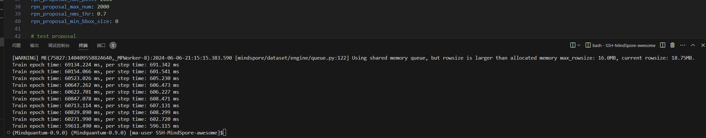
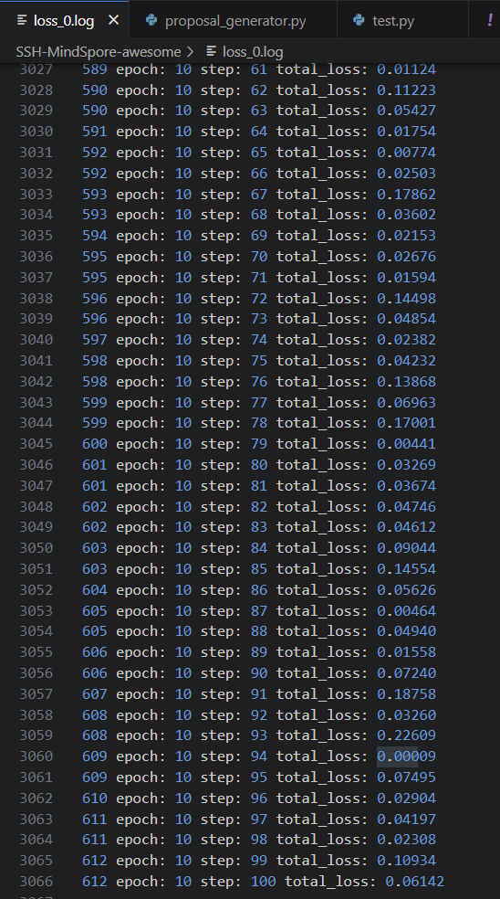
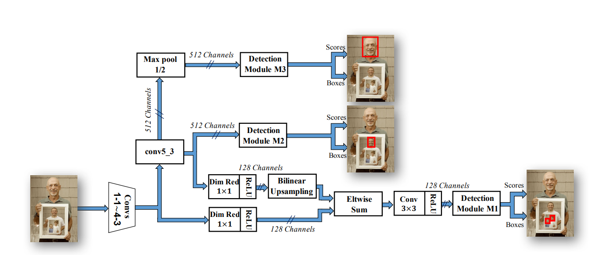
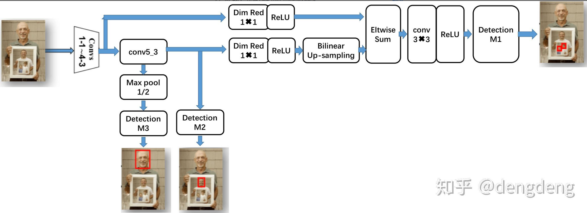
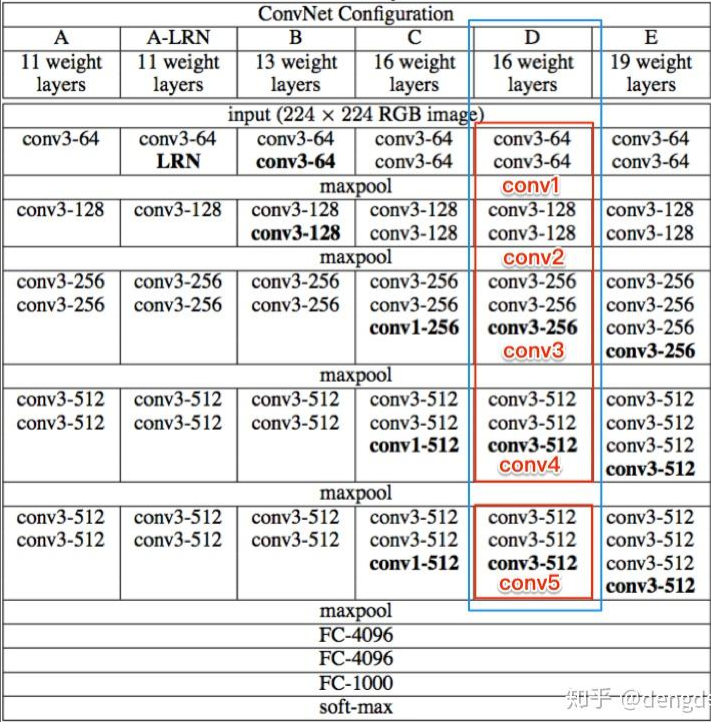
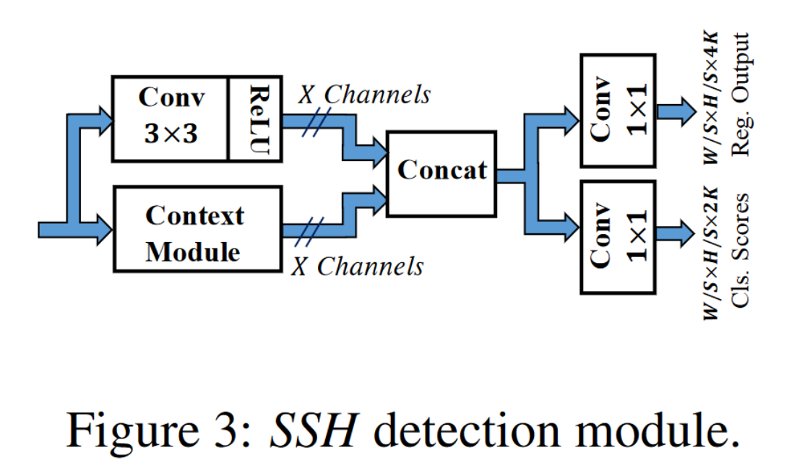
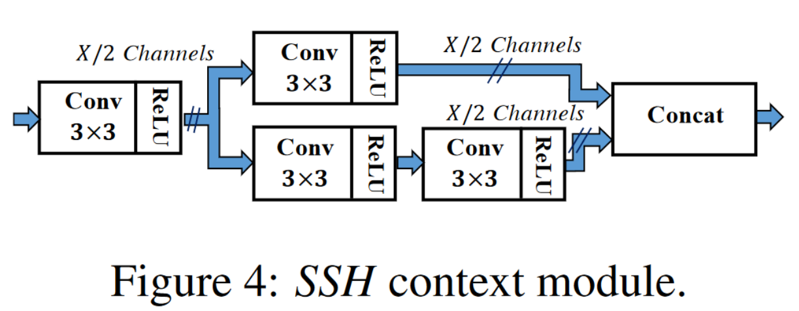

# SSH-MindSpore

文章SSH: Single Stage Headless Face Detector的mindspore版本的复现。

论文地址：[ICCV 2017 Open Access Repository (thecvf.com)](https://openaccess.thecvf.com/content_iccv_2017/html/Najibi_SSH_Single_Stage_ICCV_2017_paper.html)

项目地址：[MindSpore-Single-Stage-Headless-Face-Detector](https://github.com/Student-xtLin/MindSpore-Single-Stage-Headless-Face-Detector)

## Quick Start

### 开发环境

直接利用ModelArts平台的开发环境-Notebook-创建-公共镜像-mindquantum0.9.0-mindspore2.0.0-cuda11.6-ubuntu20.04环境。Python版本为Python3.9

规格使用GP Tnt004 GPU(16GB显存）。

具体环境要求见[requirements.txt](.\requirements.txt)文件


### 模型与数据集下载

1. vgg预训练模型：[ckpts/vgg.ckpt](https://pan.baidu.com/s/1D3T8Nkf9ha9gKCu4YqGyLA?pwd=2333 )   提取码：2333 
2. Mindrecord数据集：[dataset/mindrecord/](https://pan.baidu.com/s/1p34D-sdCDfS7_4TY52psKg?pwd=2333)  提取码：2333 
   原始数据集下载地址：http://shuoyang1213.me/WIDERFACE/
   *注：数据集存放的路径位置需要与default_config.yaml中一致*

```yaml
mindrecord_dir: './dataset/mindrecord/'
image_dir: './dataset/WIDER_train/images/'
anno_path: './dataset/WIDER_annotation/wider_face_train_bbx_gt.txt'
```

3. 项目提供的训练好的SSH模型:[ckpts/ckpt_0/ssh.ckpt](https://pan.baidu.com/s/1D3T8Nkf9ha9gKCu4YqGyLA?pwd=2333)  提取码：2333 


### 训练

训练的相关的超参数设置在[default_config.yaml](.\default_config.yaml)文件中。

解压vgg预训练模型（vgg.ckpt）至项目目录下（./vgg.ckpt），运行下面的命令，loss会被存在loss_*.log中。

```shell
python train.py
```

#### 训练过程截图





### 测试

解压ssh预训练模型（ssh.ckpt）至目录[./ckpt/ckpt_0/ssh.ckpt]下，将要测试的图片放在test文件夹下，运行下面的命令，检测结果将会保存在test_result文件夹。

或者

利用自己训练好的模型，修改test.py中的

`param_dict = load_checkpoint('./ckpts/ckpt_0/ssh.ckpt')`

将要测试的图片放在test文件夹下，运行下面的命令，检测结果将会保存在test_result文件夹。

```shell
python test.py
```

#### 运行结果

原图


人脸检测后的结果图


## 论文介绍

### 简介

SSH：Single Stage Headless Face Detector。不同于two-stages （先提供候选框然后进行分类）的检测网络，SSH是single stage的人脸检测网络，SSH直接从分类网络的前几层卷积层当中进行人脸检测。SSH网络结构是Headless的，而所谓的“Head”是指的网络参数占比较大的头模块，例如VGG16中包含大量参数的全连接层。文章指出，即使去掉这些“Head”,网络的性能也能够达到SOTA的水平。整体框架图如下图所示。



通过知乎答主'dengdeng'的调整，重新绘制整体框架如下，结构更加清晰。




### 网络结构设计

#### 网络结构pipeline

论文中实验的网络结构是基于VGG16网络结构进行改进的，VGG网络结构图如下所示：



其中，蓝色框内的则是VGG-16结构，红线框内则是VGG-16的卷积层。这些卷积层均用于提取人脸特征。
由SSH网络结构图可看出，检测模块M3是拼接在conv5-3后增加了一个max-pooling层之后的，而检测模块M2则是是直接拼接在conv5-3卷积层之后，检测模块M3和检测模块M2之间相差一个stride为2的max-pooling层操作，通过Max-pooling操作以增加感受野，从而使得M3能够检测到比M2更大的人脸。 
对于检测模块M1这一分枝，其借鉴了图像语义分割的特征融合的方法，论文中将conv4-3  和conv5-3  的特征进行了融合，以检测小尺寸人脸。而为了降低内存消耗，又通过1×1卷积操作进行了降维处理，将通道数从原来的512维降至128维，由于conv5-3输出的feature map 比conv4-3 输出的feature map 小，因此还需要双线性插值up-sampling操作将feature  map的尺寸变大，然后对应求和，经过3×3的卷积层，最后拼接上检测模块M1。 

#### anchor设计

为解决定位的子问题，SSH对anchor（即预定义的bounding box）的坐标进行了回归。生成anchor 的策略和RPN网络当中相同，均以滑动窗口方式，在每个滑动点处定义了密集重叠的K个中心点相同、尺度不同的anchor。唯一与RPN的不同之处在于RPN还定义了长宽比不同（1:1，1:2，1:3）的anchor，而SSH仅定义了一种比例的anchor，且论文作者通过实验验证不同比例的anchor 对于实验结果并没有很大的提升。对于H✖️W的feature map ,则存在H✖️W✖️K  个anchor。SSH中定义的基础anchor大小为16个像素，检测模块M1的anchor 为{1,2}，检测模块M2的anchor  为{4,8}，检测模块M3的anchor 为{16,32}

#### 尺度不变性设计

由于在自然场景的图像中，人脸的尺寸大小不一的。而所谓的尺度不变性则是指模型对于图像中不同尺寸大小脸的检测均具有良好的鲁棒性，很多模型检测尺寸比较大的人脸具有良好性能，然而却不能检测到尺寸小的人脸。对于这一问题，有些论文（例如MTCNN和HR）中的思路则是通过构造图像金字塔，但是其带来缺点则是运行inferrence的时候，每检测一张图像都要对该图像的构造一次图像金字塔结构，且每层的金字塔图像均进行一次前向运算，这显然是会对模型的耗时带来影响。而SSH通过在三个不同深度的卷积层feature map 上，拼接三个设计好的检测模块以检测小、中、大不同尺度的图像。 

#### 检测模块（Detection Module）设计



检测模块包括如下三部分：

- 3✖️3卷积层
- 上下文网络模块
- 两个1✖️1输出卷积层

首先是将3✖️3卷积和上下文网络模块的输出进行concat合并，然后输入两个1✖️1的卷积，分别用于人脸分类和人脸检测框修正坐标回归，其中，分类这一分枝输出向量维度为W/S✖️H/S✖️2K；回归这一分枝输出向量维度为W/S✖️H/S✖️4K，用于预测每个滑动点处每个含有人脸与ground truth 的相对缩放量和位移量。

| 检测模块 | 步长 | 输入anchor（base：16pixels） | 检测人脸尺寸 |
| :------: | :--: | :--------------------------: | :----------: |
|    M1    |  8   |            {1, 2}            |      小      |
|    M2    |  16  |            {4, 8}            |      中      |
|    M3    |  32  |           {16, 32}           |      大      |

#### 上下文网络模块（Context Module）设计



上下文网络模块的作用是用于增大感受野，一般在two-stage 的目标检测模型当中，都是通过增大候选框的尺寸大小以合并得到更多的上下文信息，SSH通过单层卷积层的方法对上下文（context）信息进行了合并。
通过2个3✖️3的卷积层和3个3✖️3的卷积层并联，从而增大了卷积层的感受野，并作为各检测模块的目标尺寸。通过该方法构造的上下文的检测模块比候选框生成的方法具有更少的参数量，并且上下文模块可以在WIDER数据集上的AP提升0.5个百分点 。


## Pytorch版本实现

文章SSH: Single Stage Headless Face Detector的pytorch版本的复现。该实现基于[SSH-pytorch](https://github.com/dechunwang/SSH-pytorch)。更多细节可查阅[SSH-pytorch](https://github.com/dechunwang/SSH-pytorch)中的README.md。

### Quick Start

首先需要执行命令`cd ssh-pytorch`进入ssh-pytorch项目目录。

#### 开发环境

直接利用ModelArts平台的开发环境-Notebook-创建-公共镜像-pytorch1.4-cuda10.1-cudnn7-ubuntu18.04环境。Python版本为Python3.7

规格使用GP Tnt004 GPU(16GB显存）。

具体环境要求见[requirements.txt](.\ssh-pytorch\requirements.txt)或[pytorch.yml](.\ssh-pytorch\pytorch.yml)文件

环境安装完成后，需要运行下面的命令：

```shell
cd model
make
```

#### 训练

在训练之前，数据集应该这样存放

```
data
  |--datasets
        |--wider
            |--WIDER_train/
            |--wider_face_split/
```

然后直接运行下面的命令：

`python train.py`

##### 训练过程截图

训练过程的截图和loss截图如下图所示。具体log文件见[log](.\ssh-pytorch\train.log)。


##### 测试

从[check_point.pth](https://pan.baidu.com/s/1MU9Zw0-VhOoKlVxowN4Sag?pwd=2333 )（提取码：2333）下载check_point.pth文件，放在check_point文件夹下，

然后直接运行下面的命令即可对demo文件夹中的demo.jpg文件进行推理：

`python test.py`

##### 运行结果

原图


人脸检测后


## 参考资料

1. Najibi M, Samangouei P, Chellappa R, et al. Ssh: Single stage headless face detector[C]//Proceedings of the IEEE international conference on computer vision. 2017: 4875-4884. 
2. https://zhuanlan.zhihu.com/p/64397468
3. https://github.com/dechunwang/SSH-pytorch/
4. https://github.com/Hardict/SSH-Single-Stage-Headless-Face-Detector-Mindspore/
5. https://www.mindspore.cn/tutorials/zh-CN/r1.9/index.html

